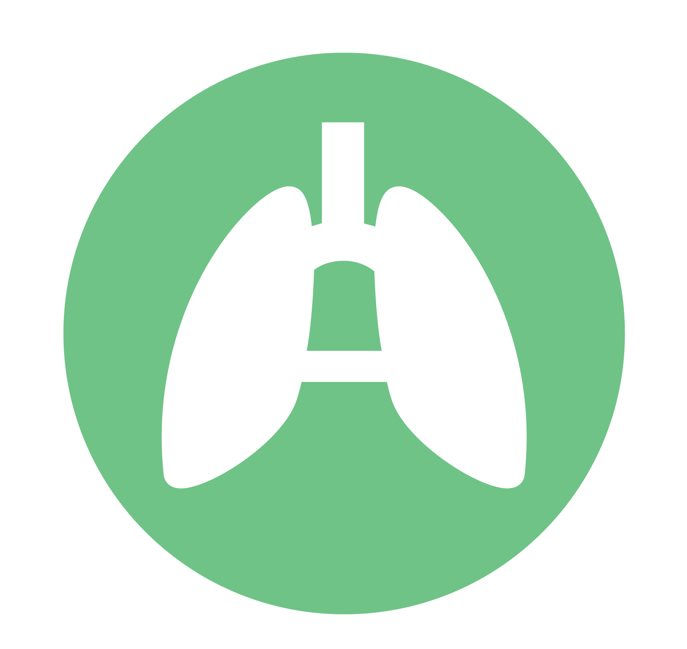
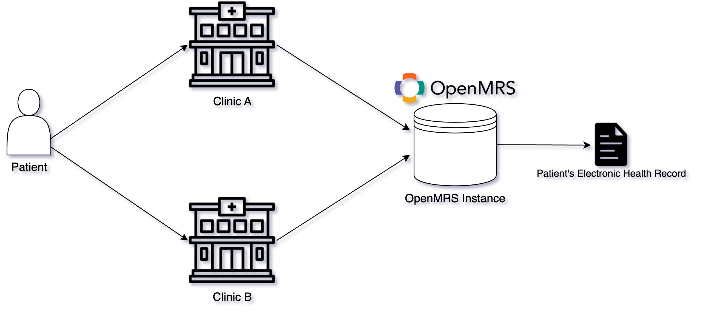

<p align="center">
     
</p>

# ALRITE Workflow Integration
Authors: Anthony Chung ([achung99@cs](mailto:achung99@cs.washington.edu)), Alex Li ([yigaol2@cs](mailto:yigaol2@cs.washington.edu)), Audrey Tseng ([actseng@cs](mailto:actseng@cs.washington.edu)), Yash Varde ([yashv3@uw](mailto:yashv3@uw.edu))

# Table of Contents

1. [Introduction](#overview)
   1. [Background](#background)
   2. [Project](#project)
2. [Developer Guide](#developer-guide)
    1. [Getting Started](#getting-started)
    2. [Deploying OpenMRS](#deploying-openmrs)
    3. [Running ALRITE](#running-alrite)
3. [Current Features](#current-features)
4. [Resources](#resources)
5. [Support](#support)
6. [Demo](#demo)

# Introduction

## Background
Developed in 2021, ALRITE (Acute Lower Respiratory Infection Treatment and Evaluation) was created as a mobile application to aid and assist healthcare workers to improve diagnosis of ALRI (Acute Lower Respiratory Infection) within children under the ages of 5. This mobile health application has streamlined the process of diagnosis and management of ALRI in Uganda. Currently, patient encounters create a unique patient record each time the patient comes into a clinic. This means if a patient visit Clinic A one week and then visits Clinic B the following week, both clinics would create a unique patient record. Ideally, both visits should be stored on one patient record, which will enable healthcare workers to assess the health trends of their patient. You can read more about the ALRITE application [here](https://pubmed.ncbi.nlm.nih.gov/34281930/).

OpenMRS (Open Medical Record System) is an open-source electronic health record (EHR) platform aimed at improving healthcare delivery in resourced-constrained environments.OpenMRS is designed to be a highly configurable and customizable system, making it adaptable to various healthcare settings and requirements. It's built on the principle that information should be stored in a way that makes it easy to be summarized and analyzed, something that's crucial in healthcare for tracking disease trends, managing patient care, and improving overall health outcomes. You can read more about OpenMRS [here](https://openmrs.org/).

## Project
The following project is a proof-of-concept of the integration between ALRITE and OpenMRS. The goal of this integration is to enable healthcare workers using ALRITE to seamlessly record, access, and analyze patient records stored in OpenMRS. This integration aligns with ALRITE's mission in improving the diagnosis of ALRI by reducing the risk of data entry errors, providing up-to-date patient information, and allow all healthcare workers using ALRITE to collaborate and assess patient records, regardless of location. Suppose we had a patient named Aaya. The goal is to (see image below). You can read more about this project here (TODO, attach paper link).


# Developer Guide

## Getting Started
To get started, run the following:
```
git clone https://github.com/anthonyphuchung/cse482-sp23-alrite-workflow.git
```

## Deploying OpenMRS
You will need an instance of OpenMRS for ALRITE to sync with. To deploy your own instance of OpenMRS, download the reference application - standalone edition [here](https://openmrs.org/download/). Follow the instructions to install OpenMRS.

## Running ALRITE
We recommend installing [Android Studio](https://developer.android.com/studio) so that you have access to an emulator. Open the project in Android Studio and simply build to run the application.

# Current Features
Currently, the following has been implemented:
1. Pushing and pulling of patient records from ALRITE application to an OpenMRS instance. Now, instead of the patient records being stored locally, it persists on an instance of OpenMRS. This means any healthcare worker in any clinic has access to patient records. 
2. ALRITE application can connect to any instance of OpenMRS, as long as there is an internet connection. For purposes of scalability, the application can connect to any instance of OpenMRS, assuming an internet connection is present. This means that healthcare workers can collaborate on a global level, rather than being restricted to a district level. Simply provide the correct URL and login credentials to connect an OpenMRS instance and ALRITE will sync with it.
3. Appending a visit to an existing patient record. Now, instead of patient visits creating a new patient record each time, ALRITE will now search inside OpenMRS to see if the patient already exists in the database. If so, that visit will simply be appending to that patient record. If not, it would create a new patient record. This helps eliminate redundancies in data entry.
4. Storing vitals and diagnoses in patient records. The ALRITE application records information such as weight, respiratory rate, mid-upper arm circumference, all of which are being stored in a patient visit which gets stored in the correct patient record when it gets pushed to OpenMRS. Additionally, any presumed and confirmed diagnoses are being synced as well.

# Support
For any developmental support, please contact [Anthony](mailto:achung99@cs.washington.edu) or [Yash](mailto:yashv3@uw.edu).

For queries regarding documentation, please contact [Audrey](mailto:actseng@cs.washington.edu) or [Alex](mailto:yigaol2@cs.washington.edu).

For any questions or discussion related to the project, please contact [Professor Anderson](mailto:andersoncs.washington.edu
) or [Dr. Ellington](mailto:lelling@uw.edu).

# Demo
[](https://youtu.be/uxvdifHHrJU)

