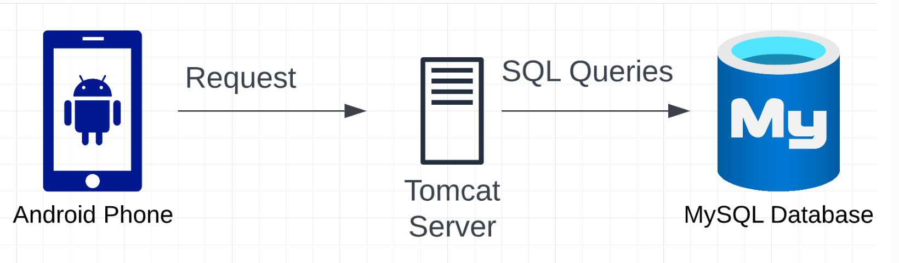
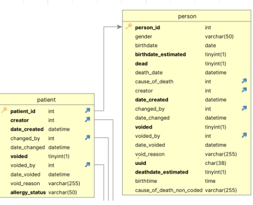

<p align="center">
     
</p>

# ALRITE Workflow Integration
Authors: Anthony Chung ([achung99@cs](mailto:achung99@cs.washington.edu)), Alex Li ([yigaol2@cs](mailto:yigaol2@cs.washington.edu)), Audrey Tseng ([actseng@cs](mailto:actseng@cs.washington.edu)), Yash Varde ([yashv3@uw](mailto:yashv3@uw.edu))

# Table of Contents

1. [Introduction](#overview)
   1. [Background](#background)
   2. [Project](#project)
2. [Developer Guide](#developer-guide)
    1. [Getting Started](#getting-started)
    2. [Deploying OpenMRS](#deploying-openmrs)
    2. [Running ALRITE](#running-alrite)
3. [Current Features](#current-features)
4. [Walkthrough](#walkthrough)
5. [Future Work](#future-work)
6. [Resources](#resources)
7. [Support](#support)

# Introduction

## Background
Developed in 2021, ALRITE (Acute Lower Respiratory Infection Treatment and Evaluation) was created as a mobile application to aid and assist healthcare workers to improve diagnosis of ALRI (Acute Lower Respiratory Infection) within children under the ages of 5. This mobile health application has streamlined the process of diagnosis and management of ALRI in Uganda. Currently, patient encounters create a unique patient record each time the patient comes into a clinic. This means if a patient visit Clinic A one week and then visits Clinic B the following week, both clinics would create a unique patient record. Ideally, both visits should be stored on one patient record, which will enable healthcare workers to assess the health trends of their patient. You can read more about the ALRITE application [here](https://pubmed.ncbi.nlm.nih.gov/34281930/).

OpenMRS (Open Medical Record System) is an open-source electronic health record (EHR) platform aimed at improving healthcare delivery in resourced-constrained environments.OpenMRS is designed to be a highly configurable and customizable system, making it adaptable to various healthcare settings and requirements. It's built on the principle that information should be stored in a way that makes it easy to be summarized and analyzed, something that's crucial in healthcare for tracking disease trends, managing patient care, and improving overall health outcomes. You can read more about OpenMRS [here](https://openmrs.org/).

## Project
The following project is a proof-of-concept of the integration between ALRITE and OpenMRS. The goal of this integration is to enable healthcare workers using ALRITE to seamlessly record, access, and analyze patient records stored in OpenMRS. This integration aligns with ALRITE's mission in improving the diagnosis of ALRI by reducing the risk of data entry errors, providing up-to-date patient information, and allow all healthcare workers using ALRITE to collaborate and assess patient records, regardless of location. Suppose we had a patient named Aaya. The goal is to (see image below). You can read more about this project here (TODO, attach paper link).


# Developer Guide

## Getting Started
To get started, run the following:
```
git clone https://github.com/anthonyphuchung/cse482-sp23-alrite-workflow.git
```

## Deploying OpenMRS
You will need an instance of OpenMRS for ALRITE to sync with. To deploy your own instance of OpenMRS, download the reference application - standalone edition [here](https://openmrs.org/download/). Follow the instructions to install OpenMRS.

## Running ALRITE
We recommend installing [Android Studio](https://developer.android.com/studio) so that you have access to an emulator. Open the project in Android Studio and simply build to run the application.

# Current Features
Currently, the following has been implemented:
1. Pushing and pulling of patient records from ALRITE application to an OpenMRS instance. Now, instead of the patient records being stored locally, it persists on an instance of OpenMRS. This means any healthcare worker in any clinic has access to patient records. 
2. ALRITE application can connect to any instance of OpenMRS, as long as there is an internet connection. For purposes of scalability, the application can connect to any instance of OpenMRS, assuming an internet connection is present. This means that healthcare workers can collaborate on a global level, rather than being restricted to a district level. Simply provide the correct URL and login credentials to connect an OpenMRS instance and ALRITE will sync with it.
3. Appending a visit to an existing patient record. Now, instead of patient visits creating a new patient record each time, ALRITE will now search inside OpenMRS to see if the patient already exists in the database. If so, that visit will simply be appending to that patient record. If not, it would create a new patient record. This helps eliminate redundancies in data entry.
4. Storing vitals and diagnoses in patient records. The ALRITE application records information such as weight, respiratory rate, mid-upper arm circumference, all of which are being stored in a patient visit which gets stored in the correct patient record when it gets pushed to OpenMRS. Additionally, any presumed and confirmed diagnoses are being synced as well.


**With our implementation above, we aim to enable the following:**
#### Data Accessibility
By allowing data to be accessible on a larger scale than one ALRITE application instance, our project records the patient's history within visiting district clinics, which enables healthcare workers from different clinics to access one record for each patient visiting, whether or not they return and frequent the same clinic. Patient A's records will be accessible from Clinic A, Clinic B, and so on.
#### Scalability
With the benefit of a shared database for patients' EMRs, this will allow the ALRITE application to be scaled much more quickly across districts, and on a larger scale, an entire country. With a stretch goal of cloud deployment for the OpenMRS database integration, this will allow ALRITE to scale much quicker to handle the input and storage of more patient data.
#### Collaboration
Because Uganda's healthcare network consists of many developers and health workers within the OpenMRS and ALRITE communities, integration with OpenMRS enables health workers using ALRITE to contribute and learn from the OpenMRS ecosystem, ultimately promoting collaboration to continue to build and innovate Uganda's current healthcare network and system.

#### Stretch Goals
- Allow anonymous patient create and search with id, age, or other corresponding value.
- Automatically config to connect to server with server IP.
- Directly display the patient health history than download first and exhibit.

## User Guide

#### Assessment

- When clicking on the **Start Assessment** from the home page, user can input the parent's and children's full name to begin assessment to children (e.g. **Aaya Tlvc**). After input the children's health information and get through the health prompt provided by ALRITE team, User should see the patients' **Assessment Summary** and **Diagnosis**. After clicking on sync, they should see the patient record on the **OPENMRS Server**, and can be downloaded by other devices connected to the same server.
<p align="center" width="100%">
    
    
</p>

#### Search

- When clikcing on **Find Patient** from the homepage, User will see patients **already** stored locally. If the User decided to get results from remote server, they should click on the search button at the top right conner, and input the name of the Patient. They can click the download button to save remote patient record to local storage, and exhibit the details of the patient.

<p align="center" width="100%">
    
    
    
</p>

#### Register

- When clicking on **Register** from the homepage, User is able to create a patient with personal and connect information. User can also take a photo or upload picture of patients to better identify the patient. In this page, User could input the detail information compared to quick creation from **Assessment**. User will also get similar results existing in **OPENMRS Server** that have similar properties to avoid duplicated creation. After **Register**, the patient information will be both stored locally and synced to remote server.

<p align="center" width="100%">
    
    
    
</p>

#### Pushing Patients On Assessment (Fallback functionality)

The fallback functionality provides an alternative means of pushing patient information into the OpenMRS database and is used in scenarios where the API mechanism faces issues which can arise when APIs are updated. This approach involves directly updating the OpenMRS database tables by firing SQL queries from the server. The use case would execute as follows:

1) The user inputs the patient's details via the ALRITE app (name, date of birth, etc).
2) The app generates an HTTP post request using the input values and sends it to the OpenMRS server.
3) The server, using JSP (Java Server Page) files, executes "insert" and "update" SQL statements based on values received in the request and modifies the OpenMRS database accordingly.

A few notable findings for the fallback functionality are as follows:

- Newer versions of Android do not allow network connections to be done in the foreground. Therefore, these need to be pushed into the background as asynchronous tasks.

- The OpenMRS server is an Apache Tomcat server, capable of running JSP pages. These provide a bridge between client devices (ALRITE app) and the OpenMRS database (MySQL). For the fallback mechanism to work, the implemented JSP pages need to be installed into the server.

- The MySQL database is capable of being logged, which allows for identification of tables being modified. The most important information is the person id, which is the foreign key that links the normalized data across various tables. 

<p align="center" width="100%">
    
    
</p>

## Developer Guide


# Resources

# Support
For any developmental support, please contact [Anthony](mailto:achung99@cs.washington.edu) or [Yash](mailto:yashv3@uw.edu).

For queries regarding documentation, please contact [Audrey](mailto:actseng@cs.washington.edu) or [Alex](mailto:yigaol2@cs.washington.edu).

For any questions or discussion related to the project, please contact [Professor Anderson](mailto:andersoncs.washington.edu
) or [Dr. Ellington](mailto:lelling@uw.edu).

