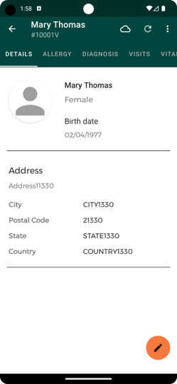

# ALRITE INTEGRATION
Anthony Chung, Alex Li, Audrey Tseng, Yash Varde
University of Washington, Spring 2023

## Overview
**As a pilot project for improving healthcare in underserved populations, our ALRITE Integration combines datbasing within the OpenMRS so that healthcare workers in Uganda can access county-wide medical records to track multiple visits, extrapolate diagnosis, and allow for scalability for handling medical records across larger regions within Uganda.**

## Background and Current Problems
**Alrite**

- Developed in 2021, ALRITE (Acute Lower Respiratory Infection Treatment and Evaluation) was created as a mobile application to aid and assist healthcare workers to improve diagnosis of ALRI (Acute Lower Respiratory Infection) within children under the ages of 5. 
- By a simple app, healthcare workers are able to input answers to questions such as "breaths per minute", "is the child wheezing?", "blood oxygen level", and combined with other information, data is handled through a simple decision tree to generate a diagnosis and display treatment options. 
- However, the current issue lies with the sustainability and scalability of handling data within the current ALRITE landscape. If patient A visits Clinic A on Monday, records a diagnosis, and shows up at Clinic B the following Monday, Clinic A and Clinic B, although dealing with the same patient, now have two different and unconnected records of patient A's visit, symptoms, diagnosis, and treatment. 
- There is no way to track the health of patient A outside each clinic's database, proving difficulty for tracing patients, tracking health records, and reporting overall statistics from each county in Uganda.

**OpenMRS** 

- An open-source software project to help developing countries track and collect EMR (Emergency Medical Records) in an electronic and generic medical record system that supports patient addition, observations, diagnostics, notes, and data in a paperless record. 
- OpenMRS can serve as a powerful tool for scalability of keeping track of medical records across different cities, districts, states, and countries. 
- Key features include patient repository, reporting, cohort and patient workflow management. OpenMRS is a library of API calls and databases, compatible with practices of all sizes. 
- It is also a community of users, funders, implementers and developers who are involved in applying health information technologies to solve medical problems.

### ALRITE Landscape
To start a patient assessment, health workers are prompted to input patient and patient parent's first and last initials. Upon inputting vitals, data is fed through a decision tree to reach a diagnoses and treatment options. Patients are stored locally on the phone's application storage, meaning that separate instances of ALRITE application within one clinic can produce and store different records that are independent of each other.

### OpenMRS Landscape
To access an OpenMRS Database, there must be a host running to serve as the local database. Once the host is running, devices are able to connect to the OpenMRS database and search up patients that exist within the hosted Database. Patient records are able to indicate personal information, vitals, diagnoses, and track past visits mapped by first and last name, as well as birth date to identify unique patient records.

## Project Motivation and Goals
**Our project's goal is to create an integration between the ALRITE application and OpenMRS Database such that a universal patient record can be accessed at individual clinics, edited, and synced such that there exists one unique record for each patient within a health district so that diagnosis, identifying information, visits, and overall patient health can be tracked and linked back to an individual patient.**

Our MVP consists of the following:
1. Push of Patients from a local ALRITE application to a global OpenMRS Database: this ensures that once patient A visits Clinic A on Monday, that their record will be accessible in one week's time from Clinic B due to the ability for ALRITE to push information up to the Global Database for health workers to access across the health district.
2. Pull of Patients from global OpenMRS Database to local ALRITE application: If a patient has already visited a clinic within the district, our application aims to be able to fetch the global medical record from OpenMRS such that the clinic can work off of the existing EMR and update it with the patient's most recent visit to add to the tracked information about the patient.

### Major Features
- Record Patients with parent name, children name, and other personal information.
- Match the patient with record existing in OpenMRS database & load the visit and health history.
- If the patient doesn't exists the OpenMRS database, create new patient and add to OpenMRS server.
- Assess the patient health condition based on health provider input.
- Locally store the assessments, and automatically update the patient record after assessment is completed.

**With our implementation above, we aim to enable the following:**
#### Data Accessibility
By allowing data to be accessible on a larger scale than one ALRITE application instance, our project records the patient's history within visiting district clinics, which enables healthcare workers from different clinics to access one record for each patient visiting, whether or not they return and frequent the same clinic. Patient A's records will be accessible from Clinic A, Clinic B, and so on.
#### Scalability
With the benefit of a shared database for patients' EMRs, this will allow the ALRITE application to be scaled much more quickly across districts, and on a larger scale, an entire country. With a stretch goal of cloud deployment for the OpenMRS database integration, this will allow ALRITE to scale much quicker to handle the input and storage of more patient data.
#### Collaboration
Because Uganda's healthcare network consists of many developers and health workers within the OpenMRS and ALRITE communities, integration with OpenMRS enables health workers using ALRITE to contribute and learn from the OpenMRS ecosystem, ultimately promoting collaboration to continue to build and innovate Uganda's current healthcare network and system.

#### Stretch Goals
- Allow anonymous patient create and search with id, age, or other corresponding value.
- Automatically config to connect to server with server IP.
- Directly display the patient health history than download first and exhibit.

## User Guide

#### Assessment

- When clicking on the **Start Assessment** from the home page, user can input the parent's and children's full name to begin assessment to children (e.g. **Aaya Tlvc**). After input the children's health information and get through the health prompt provided by ALRITE team, User should see the patients' **Assessment Summary** and **Diagnosis**. After clicking on sync, they should see the patient record on the **OPENMRS Server**, and can be downloaded by other devices connected to the same server.

    
    

#### Search

- When clikcing on **Find Patient** from the homepage, User will see patients **already** stored locally. If the User decided to get results from remote server, they should click on the search button at the top right conner, and input the name of the Patient. They can click the download button to save remote patient record to local storage, and exhibit the details of the patient.

    
    
    

#### Register

- When clicking on **Register** from the homepage, User is able to create a patient with personal and connect information. User can also take a photo or upload picture of patients to better identify the patient. In this page, User could input the detail information compared to quick creation from **Assessment**. User will also get similar results existing in **OPENMRS Server** that have similar properties to avoid duplicated creation. After **Register**, the patient information will be both stored locally and synced to remote server.

    
    
    

## Developer Guide

## Contact
Developers: Anthony Chung, Yash Varde, Alex Li
Documentation, Project Background Research, and Bookkeeping; Project Management: Audrey Tseng

